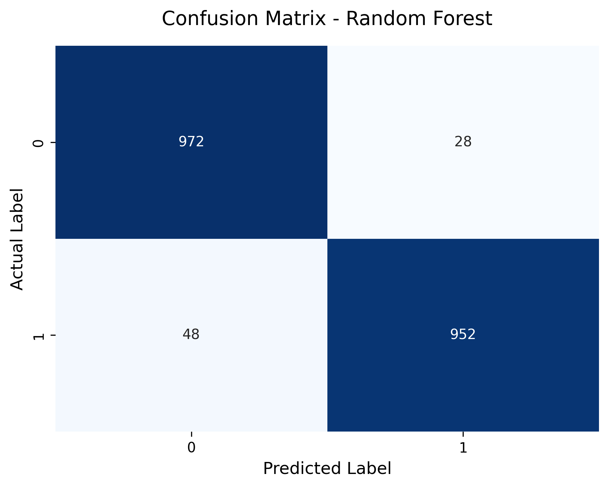

# 🏥 ML-Based ARP Spoofing Detection in IoMT

## 📌 Project Overview
The Internet of Medical Things (IoMT) connects life-saving medical devices to hospital networks. However, these resource-constrained devices are highly vulnerable to Man-in-the-Middle (MitM) attacks, specifically **Address Resolution Protocol (ARP) Spoofing**. 

This project implements a lightweight Machine Learning intrusion detection system designed to monitor medical network traffic and classify it as either normal (benign) or malicious in real-time. 

This project was completed as part of a research internship at the **Central Institute of Technology, Kokrajhar**.

## 📊 Dataset: CICIoMT2024
To ensure realistic testing, this model was trained on the modern **CICIoMT2024 benchmark dataset**.
* Extracted exactly 5,000 normal telemetry records and 5,000 ARP spoofing attack records to create a perfectly balanced dataset of 10,000 rows.
* Applied **Label Encoding** for binary classification and **Median Imputation** to handle dropped network packets.
* Utilized `StandardScaler` to normalize feature distances.

## 🛠️ Algorithms Evaluated
Seven distinct classification algorithms were tested on a stratified 80/20 train-test split:
1. Random Forest (🏆 Top Performer)
2. Decision Tree
3. AdaBoost
4. Support Vector Machine (SVM)
5. Logistic Regression
6. K-Nearest Neighbors (KNN)
7. Gaussian Naive Bayes

## 🏆 Final Results
The **Random Forest** ensemble model achieved the highest performance, effectively isolating network attacks without triggering false alarms that could disrupt hospital operations.

* **Accuracy:** 96.2%
* **F1-Score:** 0.96
* **Precision:** 0.96

### Confusion Matrix
*(The model successfully detected 952 out of 1000 attacks in the hidden testing set, with only 28 false alarms).*



## 🚀 Implementation & How to Run

### Dependencies
This project requires Python 3.x and the following standard machine learning libraries:
* `pandas`
* `numpy`
* `scikit-learn`
* `matplotlib`
* `seaborn`

### Running Locally
1. Clone this repository to your local machine:
   ```bash
  git clone [https://github.com/Debarghya-hello/IoMT-ARP-Spoofing-Detection.git](https://github.com/Debarghya-hello/IoMT-ARP-Spoofing-Detection.git)

## 📁 Repository Contents
* `IoMT.ipynb` - The complete data preprocessing, training, and evaluation pipeline.
* `Internship_Report_CITK.pdf` - The full academic report detailing the methodology, challenges, and literature review.
* `ML_Model_Comparison.csv` - The exported dataset used for model training and testing.
* `confusion_matrix.png` - Visual output of the Random Forest model's performance.
